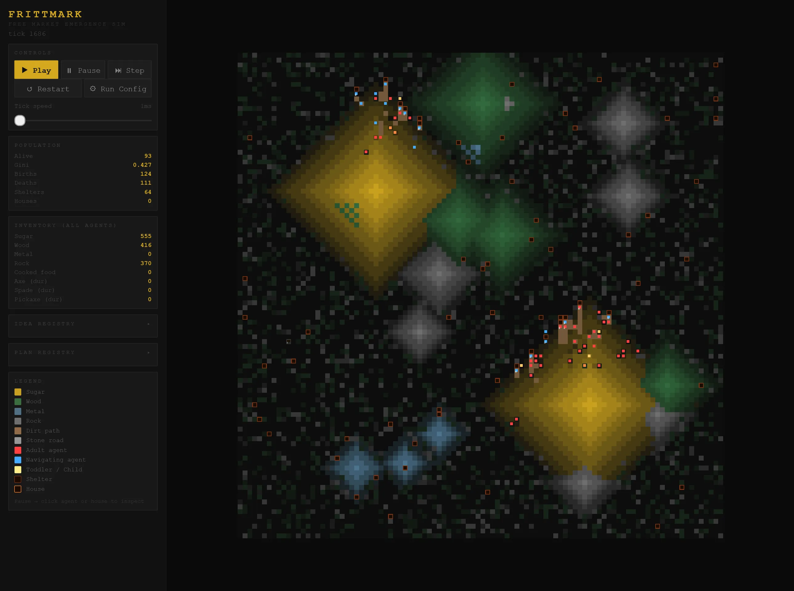

# Frittmark

**A free-market emergence simulation.**

Frittmark is a browser-based agent simulation that explores how voluntary exchange, capital accumulation, specialisation, and spontaneous order emerge from the bottom up — without central planning. It is a deliberate philosophical counterpoint to Sugarscape, the classic zero-sum resource simulation by Epstein and Axtell (1996).

The simulation is implemented as a modular TypeScript project (`src/*`) and runs in the browser via Vite.



---

## Background and Motivation

### The Sugarscape Problem

Sugarscape became famous for demonstrating that wealth inequality — Pareto-distributed accumulation — emerges inevitably from simple rules, without any deliberate exploitation. Agents with better vision and lower metabolism cluster around the two sugar mountains and accumulate indefinitely, while disadvantaged agents starve.

The simulation is compelling, but it has two structural problems that limit what it can say about actual economies:

**It is a zero-sum game.** Agents harvest a fixed resource landscape. There is no production: no combination of inputs produces outputs of greater value. One agent's gain is necessarily another's loss. This models extraction, not an economy.

**It has no voluntary exchange.** Agents ignore each other entirely. There is no specialisation, no trade, no information market, no cooperation. The model cannot produce division of labour because the concept has no representation.

These are not minor omissions. They mean that Sugarscape cannot demonstrate the key mechanisms that classical liberal and Austrian economic theory identifies as the source of broad prosperity: positive-sum trade, capital formation through deferred consumption, comparative advantage, and the spontaneous order that emerges from price signals.

### What Frittmark Adds

Frittmark retains Sugarscape's founding insight — that macro-level patterns emerge from micro-level rules — but adds the mechanisms necessary to simulate an actual economy:

- Three raw resources with distinct spatial distributions and regeneration rates
- Produced goods that combine inputs into outputs of higher utility (cooking, tool-making)
- Capital goods (tools) that raise labour productivity and degrade with use
- Permanent structures (shelters and houses) that alter metabolism and enable further production
- A fully voluntary trade system where exchange occurs if and only if both parties subjectively gain
- An information market where location knowledge is discovered and traded
- A cognitive model of agents (values, morals, needs, memory, plans) that produces realistic heterogeneous behaviour
- Heritable traits and ideas that allow cultural and technological evolution across generations

---

## Architecture

The code is organised into modular TypeScript files in `src/`.

```
1. CONFIG      — all tuning parameters in one object (CFG)
2. UTILS       — pure helper functions
3. WORLD       — grid, cells, resource generation and regeneration
4. IDEAS       — strategy registry; each idea is self-contained
5. PLANNING    — plan types + plan builders
6. AGENT       — values, needs, morals, memory, decision + plan execution
7. PATHS       — weighted pathfinding, route typing, wear/decay rules
8. SIMULATION  — tick engine, birth and death management
9. RENDERER    — canvas drawing
10. GUI        — controls, statistics panel, agent/house inspector modals
```

---

## Section 1: CONFIG

All magic numbers live in a single `CFG` object so they can be found and changed in one place. The simulation reads from `CFG` throughout; nothing is hardcoded anywhere else.

### Configuration Reference

Canonical source of truth is `src/config.ts`.

The current config covers these groups:

- World/resource generation: sugar/wood/metal/rock maxima and regen rates.
- Agent physiology and lifecycle: hunger, age phase thresholds, reproduction gating.
- Carry limits: `SUGAR_CARRY_CAP`, `WOOD_CARRY_CAP`, `METAL_CARRY_CAP`, `ROCK_CARRY_CAP`.
- Crafting/building economy: tool durability/bonuses, shelter and house costs.
- Movement and routes:
  - weighted terrain costs (`MOVE_COST_*`)
  - route multipliers (`MOVE_MULT_DIRT_PATH`, `MOVE_MULT_STONE_ROAD`)
  - wear and decay thresholds (`TRAIL_*`)
  - inactivity and traversal degradation (`PATH_UNUSED_TO_REMOVE_TICKS`, `ROAD_UNUSED_TO_PATH_TICKS`, `ROAD_TRAVERSE_TO_PATH_THRESHOLD`)
  - pathfinder budget (`PATH_MAX_SEARCH_NODES`)
- Resource targeting behavior:
  - entry-cost weighting (`RESOURCE_TARGET_ENTRY_COST_WEIGHT`)
  - edge bias weighting (`RESOURCE_TARGET_EDGE_BIAS_WEIGHT`)
- Planning/discovery/trade tuning: hunger pause/abort thresholds, discovery/spread, trade range, idle multipliers.

---

## Section 2: UTILS

Stateless helper functions used throughout:

```javascript
rand(a, b) // inclusive integer random
randf(a, b) // float random
clamp(v, a, b) // value clamped to [a, b]
pick(arr) // random array element
lerp(a, b, t) // linear interpolation
mdist(x1, y1, x2, y2) // Manhattan distance
stepToward(x, y, tx, ty) // one-cell step in the direction of (tx, ty)
totalWealth(agent) // weighted inventory sum for Gini calculation
grantIdea(agent, id) // centralised idea granting with auto-chaining
```

`totalWealth` computes a weighted sum of all inventory contents for use in Gini coefficient calculation. The weights reflect relative utility: sugar = 1, wood = 2, metal = 5, cooked food = 1.5, each tool = 4 (regardless of remaining durability).

`grantIdea` is the single entry point for giving an agent an idea. It handles the auto-grant rule: whenever `COOK_FOOD` is granted by any mechanism (discovery, inheritance, debug), `EAT_COOKED` is granted simultaneously. This relationship is defined here once rather than distributed across all callers.

---

## Section 3: WORLD

The world is a flat 100×100 grid stored as a single array of cell objects, indexed by `y * W + x`. Each cell contains:

```javascript
{
  sugar:    number,  // current sugar level (fractional)
  sugarCap: number,  // maximum sugar capacity (integer, 0–10)
  wood:     number,
  woodCap:  number,
  metal:    number,
  metalCap: number,
  rock:     number,
  rockCap:  number,
  path:     boolean, // legacy compatibility for stone_road
  routeType:'none' | 'dirt_path' | 'stone_road',
  trailWear:number,
  ticksSinceTraversal:number,
  roadTraversals:number,
  building: null | BuildingObject
}
```

### Resource Landscape Generation

Resources are placed procedurally at construction time using overlapping radial gradients with Manhattan distance (not Euclidean) for a more angular, interesting shape:

**Sugar** is generated at two fixed mountains positioned at approximately (28%, 28%) and (72%, 72%) of the grid, each with radius 24 cells. Sugar capacity at a cell is `SUGAR_MAX × (1 − distance/radius)`, producing a linear gradient from peak to zero. The two-mountain layout is inherited directly from Sugarscape.

**Wood** is placed as six randomly positioned patches with radii between 10 and 18 cells, plus a 20% chance of a thin (1–2 unit) background layer on any given cell. This creates a forest landscape with clearings.

**Metal** is placed as four small deposits with radii between 4 and 9 cells, positioned at least 12 cells from each edge. Metal is intentionally scarce and unevenly distributed.

### Resource Regeneration

Each tick, resources regenerate fractionally up to their cell capacity. Cells occupied by buildings do not regenerate (the structure suppresses the ground). Fractional values accumulate across ticks; a cell with capacity 10 and regen rate 0.25 fully regenerates in 40 ticks.

### `findResource(ax, ay, type, vision, agentMemory, carriedAmount)`

This is the central spatial query function used by harvesting and navigation. It operates in two phases:

**Phase 1 — Vision scan:** All cells within a square of radius `vision` around `(ax, ay)` are checked. Building cells are skipped. Score is based on:

- effective yield capped by remaining carry capacity
- distance from agent
- entry terrain cost
- local density edge bias (to prefer edge harvesting over deep-core penetration)

**Phase 2 — Memory fallback:** If vision returns nothing, memory entries are scored with carry-cap clamping and distance weighting, then the best entry is returned.

This two-phase design is what allows agents to pursue known resource locations outside their immediate vision, producing long-range goal-directed movement.

---

## Section 4: IDEAS

The `IDEAS` registry is the heart of Frittmark's design. Each idea is a plain object with five fields:

```javascript
IDEAS.SOME_IDEA = {
  tier:    0 | 1 | 2,         // knowledge tier (see below)
  requires: ['OTHER_IDEA'],   // prerequisite idea IDs
  needsRes: 'sugar' | 'wood' | 'metal' | null,  // for nav planning
  score(agent, world): number,  // how desirable is this action right now?
  canDo(agent, world): bool,    // can it be executed this tick?
  exec(agent, world): bool,     // perform the action; return success
}
```

**Adding a new idea requires only adding one object to `IDEAS`.** The decision loop, discovery system, inspector modal, and idea registry all pick it up automatically without any other changes.

### The Decision Loop

Each tick, a non-toddler agent scores every idea in its current `ideas` Set. Ideas with `tier > 1` are passive (modifiers, flags) and are excluded from scoring. Among the remaining ideas, the agent picks the one with the highest score and attempts to execute it. If `canDo` returns false, the agent enters the navigation planning phase (see the Agent section). Tier-1 ideas have their scores scaled up by `1 + patience × 0.35` to reward patient agents for investing in long-term production.

### Idea Tiers

**Tier 0 — Instinct.** All agents receive all Tier 0 ideas at construction. These represent behaviours too fundamental to require discovery: eating, harvesting each resource type, building basic shelter, and idling. Tier 0 ideas can be discovered from any state (no house required).

**Tier 1 — Craft.** Discoverable when idle without a house. Require prerequisites. These represent learned productive skills: cooking, tool-making, trading. Discovery probability scales with `curiosity`.

**Tier 2 — Abstract.** Discoverable when idle while assigned to a completed shelter or house. These represent complex social and economic concepts that require stable living conditions. Currently: `BUILD_HOUSE`.

### Idea Catalogue

| Idea                    | Tier | Requires                   | Description                                                                                                 |
| ----------------------- | ---- | -------------------------- | ----------------------------------------------------------------------------------------------------------- |
| `EAT_SUGAR`             | 0    | —                          | Consume 1 raw sugar from inventory; restore 35% hunger                                                      |
| `HARVEST_SUGAR`         | 0    | —                          | Navigate to and harvest sugar; spade doubles yield                                                          |
| `CHOP_WOOD`             | 0    | —                          | Navigate to and harvest wood; axe doubles yield                                                             |
| `DIG_METAL`             | 0    | —                          | Navigate to and harvest metal; pickaxe doubles yield; stops at carried metal cap                            |
| `QUARRY_ROCK`           | 0    | —                          | Navigate to and harvest rock                                                                                |
| `BUILD_SHELTER`         | 0    | CHOP_WOOD                  | Build a 3-capacity shelter for 4 wood, or navigate to gather wood toward that goal                          |
| `IDLE`                  | 0    | —                          | Do nothing; increment idle counter (enables idea discovery)                                                 |
| `COOK_FOOD`             | 1    | CHOP_WOOD                  | Convert 2 sugar + 1 wood into 2 cooked food units                                                           |
| `EAT_COOKED`            | 1    | COOK_FOOD                  | Consume 1 cooked food; restore 80% hunger (auto-granted with COOK_FOOD)                                     |
| `MAKE_AXE`              | 1    | CHOP_WOOD, DIG_METAL       | Craft an axe (50 uses) from 2 wood + 1 metal                                                                |
| `MAKE_SPADE`            | 1    | CHOP_WOOD, DIG_METAL       | Craft a spade (50 uses) from 2 wood + 1 metal                                                               |
| `MAKE_PICKAXE`          | 1    | CHOP_WOOD, DIG_METAL       | Craft a pickaxe (50 uses) from 2 wood + 1 metal                                                             |
| `UPGRADE_TO_STONE_ROAD` | 1    | QUARRY_ROCK, BUILD_SHELTER | Upgrade current dirt path cell into stone road (requires carried rock)                                      |
| `TRADE`                 | 1    | COOK_FOOD                  | Attempt bilateral voluntary exchange with a nearby agent; also shares full location memory                  |
| `BUILD_HOUSE`           | 2    | BUILD_SHELTER              | Upgrade a completed owned shelter into a house at the same tile, consuming wood (carried + stored) and rock |

### `BUILD_SHELTER` as Tier 0

Building a basic shelter — piling logs for cover — is classified as instinctive knowledge (Tier 0) rather than a discovered skill. The reasoning: primitive shelter from available materials requires no conceptual breakthrough; it is a direct response to environmental exposure. The idea's `exec` function doubles as both a wood-gatherer and a builder: if the agent's inventory is below threshold, it navigates to wood and chops; once enough wood is accumulated, it builds on the current cell.

### Minimal Behavior Balancing (June 2026)

Recent balancing changes were intentionally minimal and targeted:

- **Reproduction is now shelter-gated.** Agents can reproduce only when they are adults with sugar and cooldown eligibility, and each is in or next to a completed shelter.
- **Sugar harvesting now includes satiety damping.** `HARVEST_SUGAR` score is multiplied by a clamp-based satiety factor, reducing sugar over-focus when inventory is already stocked.
- **Wood/metal gathering now use soft hunger penalties.** `CHOP_WOOD` and `DIG_METAL` no longer hard-stop at hunger thresholds; instead, score scales down smoothly with hunger.
- **Carry-limited harvesting is active.** Sugar, wood, metal, and rock targeting and harvesting are constrained by per-resource carried caps.
- **Emergency no-food behavior is active.** At high hunger with no carried sugar/cooked food, agents override normal planning and forage sugar immediately.
- **Building terrain is constrained.** New shelters require valid building plots (forest or empty, never sugar terrain). `BUILD_HOUSE` upgrades an existing completed shelter.
- **Route system is active.** Weighted A\* pathfinding, emergent dirt paths, stone roads, and degradation by inactivity/traversal are implemented.
- **A small exploration/build nudge is applied.** Non-desperate agents with sugar reserves get a modest multiplier on building/non-food craft scores, encouraging progression out of sugar-only loops.
- **Shelter economy is active.** Agents auto-join nearby shelters when single, can deposit/withdraw shared shelter inventory, and run stockpile plans that gather sugar/wood/metal for home stores. Carried food spoils faster than stored food, eating while sheltered gives a comfort bonus, and agents with completed home assignment get slower carried-food spoilage than unsheltered agents.

### The `EAT_COOKED` Auto-grant

`EAT_COOKED` is always granted at the same moment as `COOK_FOOD`, via the `grantIdea` function. The reasoning: the knowledge of how to prepare food trivially implies the knowledge that the prepared food is edible. Requiring separate discovery of `EAT_COOKED` would be a simulation artefact with no corresponding real-world phenomenon.

`EAT_COOKED` is kept in `IDEAS` as a complete object (rather than being inlined into `COOK_FOOD`) because:

1. Its logic — consuming cooked food — is cleanly separated from the logic of cooking
2. It can appear separately in the inspector modal and idea registry
3. Future mechanics (food spoilage, food quality tiers) may give it independent significance

### Trade: Subjective Value and Mutual Gain

The `TRADE` idea implements the Austrian economic principle that voluntary exchange is always positive-sum: each party values what they receive more than what they give, making both better off.

An agent's subjective value for one unit of a resource is computed as:

```
value(agent, resource) = agent.values[relevantValue] × needMultiplier
                         ÷ max(0.5, currentStock × diminishingFactor + 0.2)
```

The numerator rises with how much the agent values that category of goods and how urgently they need it. The denominator falls as current stock rises, implementing diminishing marginal utility. A starving agent values sugar far more than a well-fed agent with full inventory.

A trade between agents A and B is executed if and only if:

- Agent A has at least 1 unit of some resource X
- Agent B has at least 1 unit of some resource Y
- `value_A(Y) > value_A(X)` — A gains from giving X and receiving Y
- `value_B(X) > value_B(Y)` — B gains from giving Y and receiving X
- The pair (X→Y) maximises total mutual gain across all feasible pairs

This correctly produces zero trades between agents with identical inventories (no gains from trade), active trade between complementary agents (one with sugar and little wood, one with wood and little sugar), and price sensitivity based on hunger and stock levels.

When a trade occurs, both agents also exchange their full location memory maps at zero additional cost, modelling the natural tendency for trade relationships to also be information channels.

---

## Section 5: AGENT

### Heritable Physical Traits

Each agent has two physical traits sampled uniformly at birth and modified by Gaussian-like mutation:

**Vision** (1–6): The radius, in cells, within which the agent perceives resources and other agents. High-vision agents find distant resources and can plan longer routes. Vision is the most powerful trait in the simulation — it determines access to information.

**Metabolism** (1–4): Scales the per-tick hunger increment. Actual hunger increase is `HUNGER_PER_TICK × metabolism / 2.5`. A high-metabolism agent needs roughly twice as much food as a low-metabolism agent and must spend more time harvesting rather than building or exploring.

For offspring of two parents, each trait is computed as the midpoint of both parents' values, with a ±1 mutation applied with 25% probability.

### Values

Values are floating-point weights in [0, 1] that scale the score of ideas. They are initialised at random within type-specific ranges and inherited from parents with ±0.12 Gaussian noise.

| Value      | Initial Range | What It Scales                                             |
| ---------- | ------------- | ---------------------------------------------------------- |
| `survival` | 0.5 – 1.0     | Score of all food-related ideas (eating, harvesting)       |
| `building` | 0.1 – 0.8     | Score of CHOP_WOOD, BUILD_SHELTER, BUILD_HOUSE, tool ideas |
| `metal`    | 0.1 – 0.7     | Score of DIG_METAL and MAKE_PICKAXE                        |
| `social`   | 0.1 – 0.7     | Score of TRADE; governs memory-sharing frequency           |

An agent with high `survival` and low `building` will always prioritise food over shelter, potentially surviving longer in hostile terrain but never accumulating capital. An agent with the inverse profile will build aggressively, potentially dying of hunger before completing a shelter — unless it is also patient.

### Morals

Morals modify agent behaviour at a meta-level. They are heritable with ±0.12 noise. Unlike values (which affect what agents want), morals affect how agents pursue their goals.

| Moral             | Range   | Effect                                                                                                                      |
| ----------------- | ------- | --------------------------------------------------------------------------------------------------------------------------- |
| `altruism`        | 0 – 1   | Agents with altruism > 0.65 and surplus ≥ 7 sugar donate 1 sugar per tick to nearby starving agents (hunger > 0.75)         |
| `patience`        | 0 – 1   | Multiplies the score of all Tier 1 ideas by `1 + patience × 0.35`; prevents abandoned navigation when not critically hungry |
| `curiosity`       | 0 – 1   | Scales `DISCOVER_CHANCE` and `SPREAD_CHANCE` by `1 + curiosity × 2.5`; governs idea discovery speed                         |
| `respectProperty` | 0.4 – 1 | Currently reserved; will gate NAP-violating actions in future phases                                                        |

### Needs

Currently one dynamic need exists:

**Hunger** (0.0 – 1.0): Increases by `HUNGER_PER_TICK × metabolism / 2.5` each tick. When it reaches 1.0 the agent dies. Hunger modulates the score of all food-related ideas multiplicatively, ensuring that a starving agent prioritises eating above all else regardless of its values.

Planning reacts to hunger in two stages: at `HUNGER_PAUSE_PLAN`, agents temporarily pause plans to eat if they have food; at `HUNGER_ABORT_PLAN_NOFOOD`, they abort plans when they have no edible inventory.

### Memory

Each agent holds a `Map<string, {x, y, sugar, wood, metal}>`, keyed by `"x,y"`. This represents the agent's knowledge of where resources exist in the world.

**Memory is updated every tick** by scanning the entire vision radius. For each cell within range, if it has any resource capacity (`sugarCap > 0 || woodCap > 0 || metalCap > 0`), the cell's current resource levels are recorded. This ensures that: (a) the agent learns about new resource locations as it explores; (b) depleted cells are correctly updated when revisited, preventing the agent from navigating repeatedly to exhausted locations.

Memory is capped at 200 entries. When the cap is reached, the oldest entry (first in Map insertion order) is evicted.

**Memory inheritance:** When a child is born, it inherits each entry from each parent's memory with 50% probability. A newborn near the sugar mountains already knows about the forests its parents explored, and vice versa.

**Memory sharing:** Each tick, agents with `social > 0.3` have a `MEM_SHARE_CHANCE × social` probability of sharing their entire memory map with a random agent within range 3. This produces an information network: location knowledge propagates outward through social connections. Trade events trigger an unconditional full memory exchange between trading partners.

### Life Phases

Agents progress through four phases based on age:

| Phase     | Age Range | Behaviour                                                                          |
| --------- | --------- | ---------------------------------------------------------------------------------- |
| `toddler` | 0 – 19    | Passive; spawns at parent's position; eats sugar from own inventory if hungry      |
| `child`   | 20 – 59   | Full agent behaviour but inherits restrictions (planned for future implementation) |
| `youth`   | 60 – 119  | Full agent behaviour; planned: rebel against inherited ideas                       |
| `adult`   | 120+      | Full agent behaviour; eligible for reproduction                                    |

### The Decision Loop in Detail

Each tick, after hunger update, a non-toddler agent executes:

```
1. If a plan exists: execute current plan step (movement/idea/gather/deposit)
  - pause to eat when hunger is high and food is available
  - abort when severely hungry and no food is available
  - low-integrity agents may occasionally drop plans and re-score

2. Emergency no-food forage:
  If hunger is high and inventory food is empty, force sugar forage behavior.

3. Plan formation stage:
  - form shelter stockpile plan when a completed home is understocked
  - form stay-idle plan when the home is well stocked and hunger is low
  - any plan can only be formed if all idea steps are already known

4. Score all ideas in agent.ideas where tier ≤ 1:
   For each idea: compute score(agent, world)
   Tier-1 ideas: multiply score by (1 + patience × 0.35)
   Pick idea with highest score

5. IF best idea CAN execute:
   exec(agent, world); reset idleTicks

6. IF best idea CANNOT execute AND idea has needsRes:
   Call findResource(x, y, needsRes, vision, memory)
   IF target found AND target ≠ current cell:
    Build a NAVIGATE_IDEA plan (MOVE_TO → EXEC_IDEA)
    and execute its first step
   IF target == current cell:
     Re-attempt exec (resource is here but something else blocked)

7. IF no actionable idea:
   Increment idleTicks; call _tryDiscover(world)
```

### Planning Module

Planning structures and builders live in `src/planning.ts`. Agent decision code in `src/Agent.ts` creates plans via this module and executes plan steps in the main tick loop.

Current plan types:

- `NAVIGATE_IDEA`: move to a target cell, then execute one idea
- `SHELTER_STOCKPILE`: gather/deposit resources until home reserves reach target levels
- `STAY_IDLE`: return to home and intentionally idle for several steps when fed and well stocked

An agent can hold only one active plan at a time.

### Idea Discovery

`_tryDiscover` fires when the idle counter meets `IDLE_THRESHOLD`. It rolls two independent chances:

**Discovery roll:** `random < DISCOVER_CHANCE × (1 + curiosity × 2.5)`

If successful, the agent picks a random idea from the eligible pool (Tier 1 ideas when unsheltered; Tier 1 + Tier 2 ideas when assigned to a completed shelter/house) for which all prerequisites are met and which the agent does not yet know. The idea is granted via `grantIdea`.

**Spread roll:** `random < SPREAD_CHANCE × (1 + curiosity × 2.5)`

If successful, the agent picks a random agent within range 2 and learns one of their ideas that the agent doesn't know (subject to prerequisites). This models casual conversation and cultural diffusion.

Both rolls reset `idleTicks` to 0 on success.

While executing the `STAY_IDLE` plan, both discovery and spread rolls are multiplied by `STAY_IDLE_DISCOVER_MULT`, modeling higher idea-formation odds during safe, low-pressure downtime.

### Reproduction

Two adults within Manhattan distance 1 can reproduce only when all of the following are true:

- Both are in `adult` phase
- Both have `reproCooldown = 0`
- Both hold at least `REPRO_MIN_SUGAR` sugar
- Both are in or adjacent to a completed shelter cell

When eligible partners meet, one child is spawned at the parents' location with:

- Physical traits: midpoint of parents' values with mutation
- Values: midpoint with ±0.12 noise
- Morals: midpoint with ±0.12 noise
- Ideas: all Tier 0 ideas plus ~65% random subset of each parent's non-Tier-0 ideas (grantIdea is used, so COOK_FOOD correctly carries EAT_COOKED)
- Memory: ~50% random subset of each parent's memory
- Inventory: 2–6 sugar

Both parents enter `REPRO_COOLDOWN` (60 ticks).

---

## Section 6: SIMULATION

The `Simulation` class owns the `World` and manages the tick lifecycle:

```
1. world.regenerate()         — fractional resource growth on all non-building cells
2. for each agent: a.tick(w)  — hunger, phase update, decision loop, building, altruism, memory share
3. Remove dead agents         — release home cell resident slot
4. Reproduce                  — scan eligible adult pairs
```

The tick loop in the GUI measures wall-clock execution time and subtracts it from the configured interval, so the simulation maintains the requested tick rate even when computation takes longer than expected. If computation exceeds the interval, the next tick starts immediately without waiting.

### Gini Coefficient

The inequality metric is computed each tick using the standard discrete formula:

```
G = Σ (2i - n - 1) × wealth[i]
    ──────────────────────────
           n × Σ wealth[i]
```

where `wealth[i]` is the sorted (ascending) weighted wealth of agent `i` and `n` is the population size. The result is in [0, 1], where 0 is perfect equality and 1 is total concentration.

---

## Section 7: RENDERER

The renderer draws the world onto an HTML Canvas element sized to `GRID_W × CELL_PX` by `GRID_H × CELL_PX` pixels (700×700 at defaults). The `image-rendering: pixelated` CSS property ensures crisp cell boundaries at any browser zoom level.

### Cell Rendering

Each tick, the renderer builds an agent position map (`Map<cellIndex, Agent[]>`) in O(n) over agents, then iterates all cells in row-major order.

**Ground cells:** Route type is rendered first (stone road or dirt path). Otherwise, dominant resource (highest current value above a floor of 0.4) determines the cell colour. Each resource has a base RGB triple; the cell colour is linearly interpolated between background and resource colour by relative amount.

| Resource | Colour                            |
| -------- | --------------------------------- |
| Sugar    | `rgb(200, 160, 30)` — gold        |
| Wood     | `rgb(50, 105, 60)` — forest green |
| Metal    | `rgb(75, 115, 140)` — steel blue  |
| Rock     | `rgb(110, 110, 110)` — stone grey |

**Building cells:** Rendered with a very dark brown background and a border whose colour indicates type (shelter: `#7a3515`, house: `#ff9030`) and construction state (dim grey if under construction). Incomplete buildings display a thin progress bar at the bottom of the cell.

**Agent rendering:** Agent dots are drawn on top of the cell background. Colour encodes phase and navigation state:

| Colour                | Meaning                               |
| --------------------- | ------------------------------------- |
| `#ff4040` red         | Adult, not currently executing a plan |
| `#44aaff` blue        | Any adult with an active plan         |
| `#ff8840` orange      | Youth                                 |
| `#ffcc66` yellow      | Child                                 |
| `#ffee99` pale yellow | Toddler                               |

When multiple agents occupy one cell, the count is printed in white over the dot.

---

## Section 8: GUI

### Controls Panel

**▶ Play / ⏸ Pause:** Start and stop the simulation loop.

**⏭ Step:** Execute exactly one tick while paused. Useful for detailed observation of individual agent decisions.

**Tick speed slider:** Adjusts the target milliseconds between ticks (50ms – 3000ms). The slider controls `tickMs`. The loop computes `wait = max(0, tickMs - elapsed)`, so the requested rate is honoured when computation is fast and gracefully degraded when it is slow.

### Statistics Panel

Updated every tick:

- Population (alive agents)
- Gini coefficient (0.000 – 1.000)
- Cumulative births and deaths
- Complete shelters and houses
- Total inventory across all living agents (dynamic across all inventory keys)

### Idea Registry (collapsible)

Clicking "Idea Registry" in the sidebar expands a panel listing all ideas with:

- Tier badge (T0/T1/T2)
- Idea name
- Count of agents currently holding the idea
- **⚡all** button: grants the idea to every agent who currently meets the prerequisites

The panel updates on each tick when open. This is useful for testing specific mechanics: teaching the entire population to trade at tick 1 to observe the effect on wealth distribution, for example.

### Agent Inspector Modal

When the simulation is paused, clicking on any cell containing an agent opens the inspector modal for the first agent at that cell. The agent's cell receives a white highlight border on the canvas while the modal is open.

The modal is divided into five sections:

**Status:** ID, phase, age, position, vision, metabolism, home cell coordinates, hunger percentage, weighted wealth, memory size (number of known cells), idle tick count, and current action (which idea is executing, or navigation target and goal if navigating).

**Values:** All four values rendered as labelled progress bars (gold). The bars reflect the agent's actual decision weights and update live as you step the simulation.

**Morals:** All four morals as labelled progress bars (teal).

**Inventory:** All known inventory slots (including rock and tools) are shown in a stable order with `−` and `+` debug buttons.

**Ideas:** All ideas in the registry listed with tier badge, known/unknown state (✓ green / ○ learnable / · prerequisites missing), and action buttons. Known Tier 1+ ideas can be removed. Unknown ideas with prerequisites met can be granted. Unknown ideas without prerequisites are shown greyed out with the missing prerequisites listed in a tooltip.

---

## How to Add a New Idea

The `IDEAS` object is the only place that needs to change. Add an entry:

```javascript
IDEAS.DISTILL_SPIRIT = {
  tier: 2, // requires a house to discover
  requires: ['COOK_FOOD', 'DIG_METAL'], // prerequisites
  needsRes: null, // no navigation needed to execute
  score(a, w) {
    // Only interesting if agent has surplus sugar and wood
    if (a.inventory.sugar < 5) return 0
    if (a.inventory.wood < 2) return 0
    // Highly social agents produce more; patience scales long-term interest
    return a.values.social * a.morals.patience * 4
  },
  canDo(a, w) {
    return (
      a.inventory.sugar >= 5 && a.inventory.wood >= 2 && a.inventory.metal >= 1
    )
  },
  exec(a, w) {
    a.inventory.sugar -= 5
    a.inventory.wood -= 2
    a.inventory.metal -= 1
    a.inventory.spirit = (a.inventory.spirit || 0) + 3 // new inventory type
    return true
  },
}
```

The new idea will automatically:

- Appear in the Idea Registry panel with a live adoption count
- Be scored by every agent that knows it, each tick
- Be discoverable by idle agents in a house who know COOK_FOOD and DIG_METAL
- Be listed in the agent inspector modal with grant/remove controls
- Be included in the ⚡all teach button

You also need to add `spirit` to the inspector modal's `invKeys` array if you want it to appear there. Everything else is automatic.

### The `needsRes` Field

This field tells the navigation planner what resource to seek when `canDo` returns false. For ideas that combine multiple prerequisites (like `DISTILL_SPIRIT` above), choose the scarcest or most distant one — that is the binding constraint most likely to require navigation. If `needsRes` is `null`, failed execution simply results in idling rather than navigation.

---

## Known Limitations and Design Choices

**No explicit energy burn per move.** Movement now has weighted traversal time/cost for routing, but hunger does not yet increase directly as a function of distance traveled.

**Memory never expires (only updates).** An agent heading for a wood patch that was depleted last tick will find it empty and update their memory correctly — but they wasted travel time. A time-weighted confidence score on memory entries would improve navigation efficiency but adds complexity.

**Simplified spoilage is implemented.** Carried sugar/cooked food can spoil per tick, and stored food in completed buildings spoils at lower rates. This already creates value for shelter storage, but rates are still globally tuned and not yet differentiated by shelter vs house quality.

**Youth rebellion is not implemented.** The design calls for youth-phase agents to probabilistically try ideas opposite to their inherited ones, strengthening inherited ideas on failure and potentially replacing them on success. This would produce genuine cultural evolution across generations. Currently, youth agents behave identically to adults.

**`respectProperty` moral is reserved.** The design includes the possibility of agents with low property respect stealing from others. This requires a careful implementation of the NAP (Non-Aggression Principle) detection and response system before it makes philosophical sense to enable.

**Simultaneous tick execution.** All agents execute their tick within the same pass over the agents array. Agents earlier in the array act on a world that later agents have not yet modified. A more rigorous simulation would randomise execution order each tick or use double-buffering. For the current purpose this is an acceptable simplification.

---

## Planned Features

**Phase 2:**

- Youth rebellion mechanic: heritable idea mutation
- A Gini-over-time chart in the sidebar

**Phase 3:**

- Explicit information commodity: agents can offer location data as a tradeable good in exchange for resources rather than sharing it freely
- Route optimization: caching/route reuse to reduce pathfinding CPU at large populations
- `respectProperty` implementation: theft as an actionable idea gated behind low moral score, with detection and social ostracism consequences

**Phase 4:**

- LLM-assisted idea injection: describe a new economic behaviour in natural language and have it translated into an `IDEAS` entry via the Anthropic API
- Multi-agent households with division of labour enforced by home assignment
- Population charts and historical playback

---

## Running the Simulation

Install and run with Vite:

```bash
npm install
npm run dev
```

For a production build:

```bash
npm run build
npm run preview
```

The simulation starts automatically. Recommended workflow for first observation:

1. Let it run for 100 ticks at 1000ms per tick
2. Pause and open the Idea Registry — note which ideas have spread naturally
3. Click an agent near the wood patches to inspect their memory and navigation state
4. Use ⚡all on `TRADE` and observe whether wealth distribution changes
5. Grant a wood-area agent `BUILD_SHELTER` + 10 wood via the modal, then watch it build

---

## Design Philosophy

Frittmark is built around three constraints:

**Every emergent phenomenon should be traceable to agent-level rules.** No global variable silently drives population dynamics. If the Gini coefficient rises, it is because specific agents with specific traits are making specific decisions. The inspector modal exists to make this traceable.

**The Ideas system should be open.** The decision not to hardcode agent strategies into a fixed behaviour tree, but to make each idea a self-contained object with executable logic, means that the simulation is extensible without understanding its internals. A new economic behaviour is a new `IDEAS` entry.

**The simulation should be philosophically coherent.** Trade is voluntary and positive-sum by construction. Shelter is instinctive. Abstract planning requires stable conditions. Altruism emerges from a moral trait rather than being enforced. These choices reflect a view that good simulation design should be grounded in defensible models of human behaviour, not just convenient mechanics.
